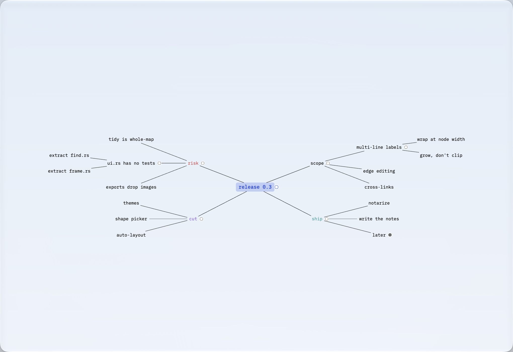

# mind67

**A keyboard-driven mind map that is only text and lines.** An infinite canvas
you fly around, built in Rust on [GPUI](https://gpui.rs) — the same GPU UI stack
Zed uses. No web view, no SwiftUI, no scene graph you have to learn.

[](https://github.com/1234igor/mind67/actions/workflows/ci.yml)
[](https://www.rust-lang.org)
[](https://gpui.rs)
[](https://www.apple.com/macos/)
[](LICENSE)



Everything on screen is a line cut into a plate. There are no colours to pick,
no shapes to choose and no themes to browse — so the only thing left to do with
the app is think, which is the point.

## Why it is like this

Most mind-mapping apps are drawing programs that happen to draw trees. This one
is a keyboard tool: every structural move is a chord, the pointer is optional,
and the file on disk is JSON you can read. Two modes keep the arrow keys honest
— **Browse** walks the map, **Edit** walks the caret — because one set of arrows
cannot do both and pretending otherwise is where these apps usually go wrong.

Frames are culled and cached, so a 2000-node map paints in half a millisecond
and an idle caret costs nothing. See [Performance](#performance).

## Saving

Everything autosaves ~0.7 s after you stop, and again on quit — the map, the
camera pose, the theme, and the window's own size and position. **⌘S** is there
for when you want to *know* it landed, not for when you have to.

**File ▸ Open…** (**⌘O**) switches documents and **File ▸ Open Recent** keeps
the last eight. Opening one flushes whatever the previous document still owed to
disk first. A launch reopens whatever you had open last; the first one ever gets
the starter map at:

```
~/Library/Application Support/jotmind/map.json
```

Set `JOTMIND_FILE=/path/to/other.json` to override both. The file is plain JSON
and safe to hand-edit — it is validated and repaired on load (dangling edges
dropped, parent cycles broken, ids realigned to their keys, focus reset), and
every field except `nodes` may be omitted.

On macOS, writes use Foundation's atomic file replacement and sync the completed
file. This also allows safe saves to documents selected through App Sandbox.
If the file exists but cannot be read at all, the app opens a **scratch**
session and says so in the status line, rather than autosaving a fresh map over
something you might still rescue by hand.

`--demo` and `--empty` are scratch sessions: they open a throwaway map and never
touch the saved one.

## Shortcuts

`⌘/` opens this list inside the app.

### Two modes

Arrows cannot both walk the map and walk the caret, so they do whichever the
mode says. **Browse** is the resting state; typing or ↩ drops into **Edit**, and
↩ or Esc comes back out. Everything else works the same in both.

| Key | Action |
|-----|--------|
| **typing** or **↩** | browse → edit |
| **↩** or **Esc** | edit → browse |

The split lives in the **keymap**, not in the handlers: `backspace` is bound to
two different actions under `mode == edit` and `mode == browse`. That matters
because GPUI stops propagating a key as soon as a binding matches — a handler
that matches and then bails because the mode is wrong swallows the key, which is
exactly why ⌫ used to do nothing at all in Browse.

### Navigate (browse)

| Key | Action |
|-----|--------|
| **← → ↑ ↓** | Move focus through the map (parent / child / nearest neighbour) |
| **⌥↑** / **⌥↓** | Previous / next sibling, with wraparound |
| **Esc** | Climbs out: menu → find → panel → drag → edit → selection → edge → parent |
| **click** a node | Focus it, and make it the whole selection |
| **click** the node you are already on | Edit it, caret where you clicked |

Navigation pans the camera only when the focused node would leave the
comfortable middle of the view — it does not recentre on every keystroke.

### Select (browse)

| Input | Action |
|-------|--------|
| **click** empty ground | Let go of everything |
| **right-click** (or **⌃click**) | A menu for whatever is under the pointer |
| **drag** empty ground | Rubber-band everything the rectangle touches |
| **⇧ drag** empty ground | Add the rectangle to what is already selected |
| **⇧ click** a node | Add or remove that one |
| **⌘ click** a node | Add its whole branch |
| **⌘A** | Select every node |
| **Esc** | Deselect |

Delete, drag and nudge act on the selection, and **nothing selected means
nothing happens** — that state is representable, which is what makes clicking
away mean something. The keyboard cursor is a separate idea: it stays where it
was, drawn with a quiet ink rule rather than the blue one, so the arrows always
have somewhere to start.

The context menu offers what makes sense for a node, an edge or empty ground,
each row labelled with its keyboard equivalent — it is also how the app explains
itself. Right-clicking a node outside the selection picks it first, the way a
list does, so nothing acts on something you cannot see selected.

A dragged branch is "select the branch, then drag" rather than a modifier held
during the drag — ⇧ means *pick nodes* everywhere, with no second meaning that
depends on when you pressed it.

### Write (edit)

| Key | Action |
|-----|--------|
| **← →** | Caret by character |
| **⌥← ⌥→** | Caret by word |
| **↑ ↓** or **home** / **end** | Caret to start / end |
| **⌫** / **⌦** | Delete back / forward |
| **⌥⌫** | Delete word |
| **⌘⌫** | Clear the label |
| **click** the text | Caret there |

## Performance

Set `MIND_MAP_DEBUG=1` to put a frame readout in the canvas corner:

```
paint 0.53ms · build 0.23ms · 709 paths · 348/2000
```

`build` is turning the graph into a paint list, `paint` is the canvas pass, and
`348/2000` is nodes drawn against nodes in the map. Measured on a 2000-node map:

| | paint | build | paths | drawn |
|---|---|---|---|---|
| fitted (15%) | 0.53 ms | 0.23 ms | 709 | 348 |
| zoomed (57%) | 0.42 ms | 0.11 ms | 142 | 69 |

Culling is what keeps that flat — without it the same frame is **2.18 ms and
3999 paths** for all 2000 nodes. Shaped label widths are cached per node and
recomputed only when the text or the painted size changes, so an idle caret
blink costs nothing. Strokes that share a colour are batched into one path
(543 → 104 at 57 %); that did not measurably move the clock at this size, but it
keeps the draw-call count proportional to nodes rather than to ticks.

## Layout

| Module | Role |
|--------|------|
| `graph` | The map: nodes, edges, tidy layout, text editing, selection |
| `camera` | Pan, zoom, fit, and the comfortable-middle rule |
| `store` | The JSON document: load, validate, repair, atomic durable save |
| `history` | Undo/redo |
| `paint` | Graph → paint list, with culling and per-node caches |
| `ui` | The GPUI view, keymap, menus and panels |
| `markdown`, `convert`, `export_svg` | Getting a map back out |
| `mac`, `pinch` | The two places GPUI leaves no API: magnify events, and the Help menu |

`graph`, `camera`, `history` and `store` are pure Rust with no GPUI dependency
and carry the whole test suite. GPUI only paints.

```bash
cargo test
```

## Not there yet

Honest gaps, all verified against the current code:

- **Strict tree, no cross-links.** A node has one `parent: Option<u64>`, so a
  node cannot belong to two branches.
- **Single-line labels.** No wrapping inside a node.
- **Edges cannot be edited on their own** — no dragging an endpoint to a
  different node, no deleting an edge without its node, and an edge is only
  hit-tested near its midpoint.
- **`ui.rs` has no tests.** It is 5,000 lines and the only module without any;
  the logic worth testing wants extracting from it first.
- **Exports do not know about images.** `export_svg`, `markdown` and `convert`
  read a node's label, and an image node's label is empty, so pictures come out
  as blank nodes.
- **A map has no sibling order.** Order is read off the geometry, and the layout
  re-balances a root's branches across the two sides, so exporting to Markdown
  or OPML and importing it back preserves the tree and the labels but not the
  sequence. A *second* round trip changes nothing, so nothing drifts — but
  giving nodes a real order is the fix, and it needs a document-format change.

## Licence

[MIT](LICENSE). Use it in commercial work, including paid App Store apps,
without asking. See [THIRD-PARTY.md](THIRD-PARTY.md) for what is bundled and
under what terms.

The licence covers the code. The name **mind67** and the app icon are not part
of the grant — fork the app freely, but ship it under your own name and your own
icon so nobody is confused about which one they installed.
