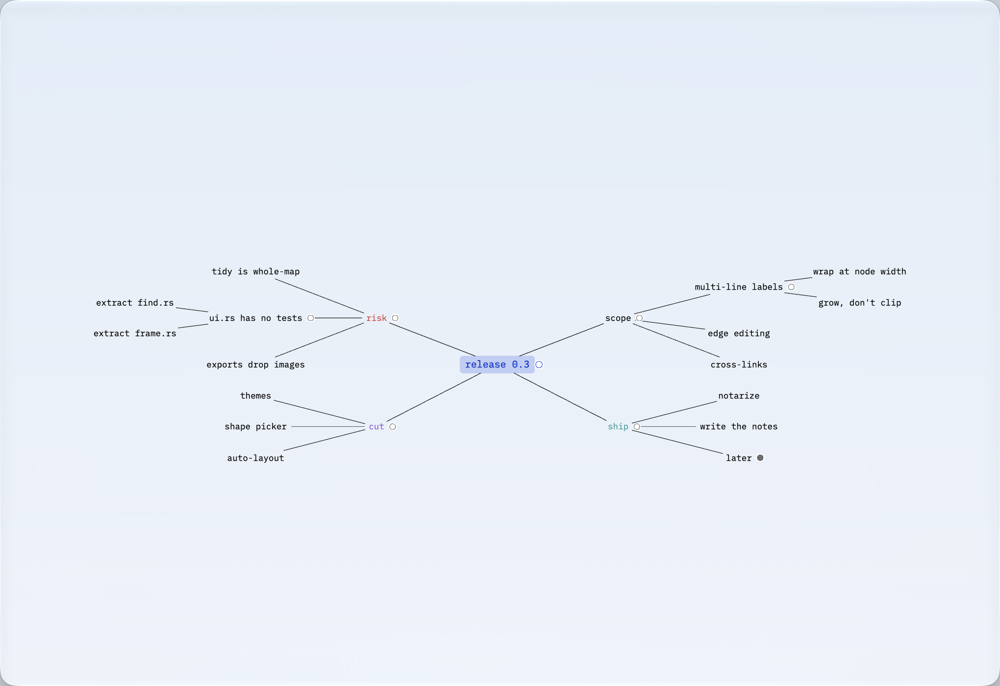

# mind67

mind67 is a macOS mind-mapping app built in Rust with [GPUI](https://gpui.rs).
Create and rearrange branches with the keyboard, add text or images, and save
maps as local JSON files.



## Features

- A zoomable canvas with automatic layout, branch folding, and a minimap.
- Text labels with line breaks, image nodes, edge labels, and node colors.
- Keyboard editing, multiple-node selection, drag selection, and undo/redo.
- Find and replace, plus a shortcut panel with customizable commands.
- Light and dark themes.
- Markdown and OPML import; Markdown, OPML, text outline, and SVG export.
- Autosave, recent documents, and restored camera and window positions.

## Build and run

Use macOS with Rust stable and Xcode, including the Metal compiler, installed.
From the repository root:

```sh
./run.sh
```

This builds and opens `dist/mind67.app`. To build without launching, run
`./scripts/build-app.sh`. Add `--install` to copy the app into `/Applications`.
These local builds use an ad-hoc signature.

To try a temporary map, run `./run.sh --demo` or `./run.sh --empty`. These sessions
do not overwrite your saved map. For development, use `./dev.sh`; see
[CONTRIBUTING.md](CONTRIBUTING.md).

## Using the map

In **Browse** mode, select and move nodes. Start typing or press Return to edit
the focused node. Press Return or Escape to return to Browse; Shift-Return adds
a line break while editing.

| Default shortcut | Action |
|---|---|
| Tab / Shift-Tab, in Browse | Create a child / sibling |
| Command-Return / Command-Shift-Return | Create a child / sibling from either mode |
| Arrow keys, in Browse | Move selected nodes |
| Shift-arrow keys, in Browse | Move selected nodes farther |
| Option-arrow keys, in Browse | Navigate between nodes |
| Arrow keys, in Edit | Move the text caret |
| Command-R | Tidy the layout |
| Command-period | Fold or unfold a branch |
| Command-F | Find |
| Command-0 | Fit the map in the window |
| Command-T | Switch light/dark theme |
| Command-N / Command-O | New map / open map |
| Command-S / Command-Shift-S | Save / save as |
| Command-Z / Command-Shift-Z | Undo / redo |
| Command-slash | Open the shortcut panel |

Click a node to select it. Shift-click adds or removes a node from the selection;
Command-click selects its branch. Drag on empty canvas to select a group.
Right-click a node, edge, or empty canvas for its available commands.

## Files and saving

The app autosaves about 700 ms after a change and saves again on quit. It reopens
the last document at launch. The first map is stored at:

```text
~/Library/Application Support/jotmind/map.json
```

The `jotmind` directory name is retained from an earlier app name. It also holds
recent-document settings, shortcut overrides, and the shared `images/` store.
Image files are separate from map JSON; copying a JSON file alone does not
include its pictures.

Use **File → Open** to switch documents and **Save As** to choose a file location.
For a development launch, `JOTMIND_FILE` can override the startup document path.

Saves replace the previous file atomically. If an existing document cannot be
loaded, the app opens a temporary session and reports the error instead of
replacing it with a new map.

See the [privacy policy](PRIVACY.md) for data handling.

## Limitations

- Each node has one parent; cross-links between branches are not supported.
- Exports omit image content.
- Markdown and OPML round trips can change sibling order because ordering is
  derived from node positions.

## Development

See [CONTRIBUTING.md](CONTRIBUTING.md) for development builds and checks.
The main modules are `graph` (map structure and editing), `camera` (navigation),
`store` (documents), `paint` (rendering), and `ui` (controls and interaction).

Set `MIND_MAP_DEBUG=1` when launching the binary to display paint and build
timings, path counts, and visible-node counts. These are rendering diagnostics;
they do not measure total input latency. Results depend on the map, zoom level,
hardware, and build.

## License

The code is [MIT licensed](LICENSE). Dependencies and fonts retain their own
licenses; see [THIRD-PARTY.md](THIRD-PARTY.md).

The mind67 name and app icon are excluded from the code license. Use your own
name and icon when distributing a fork.
